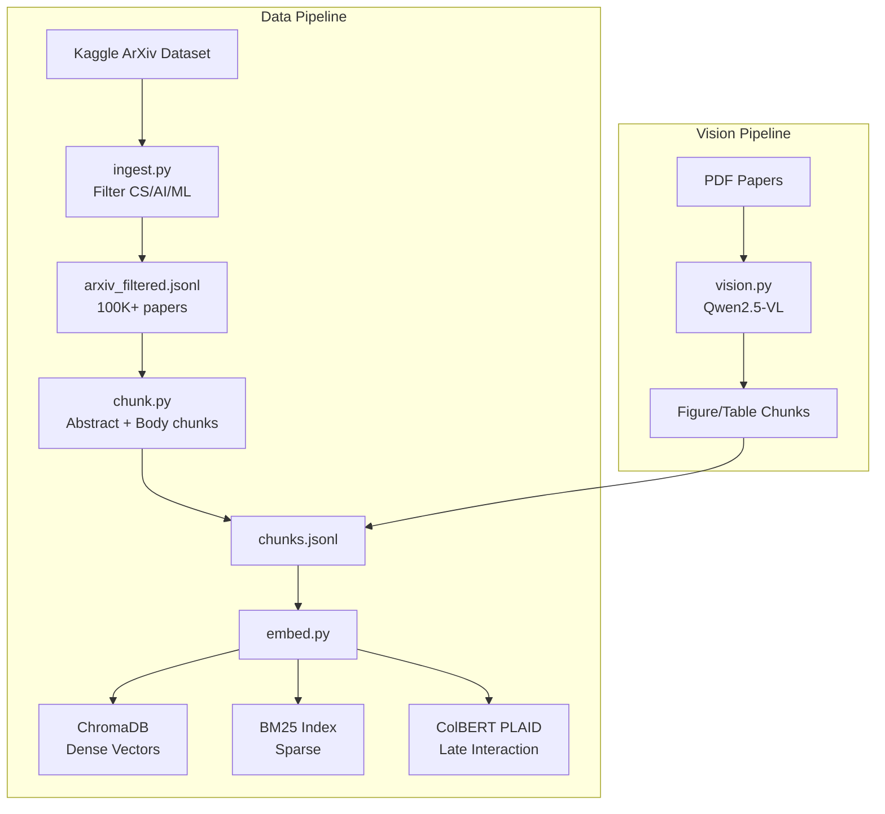
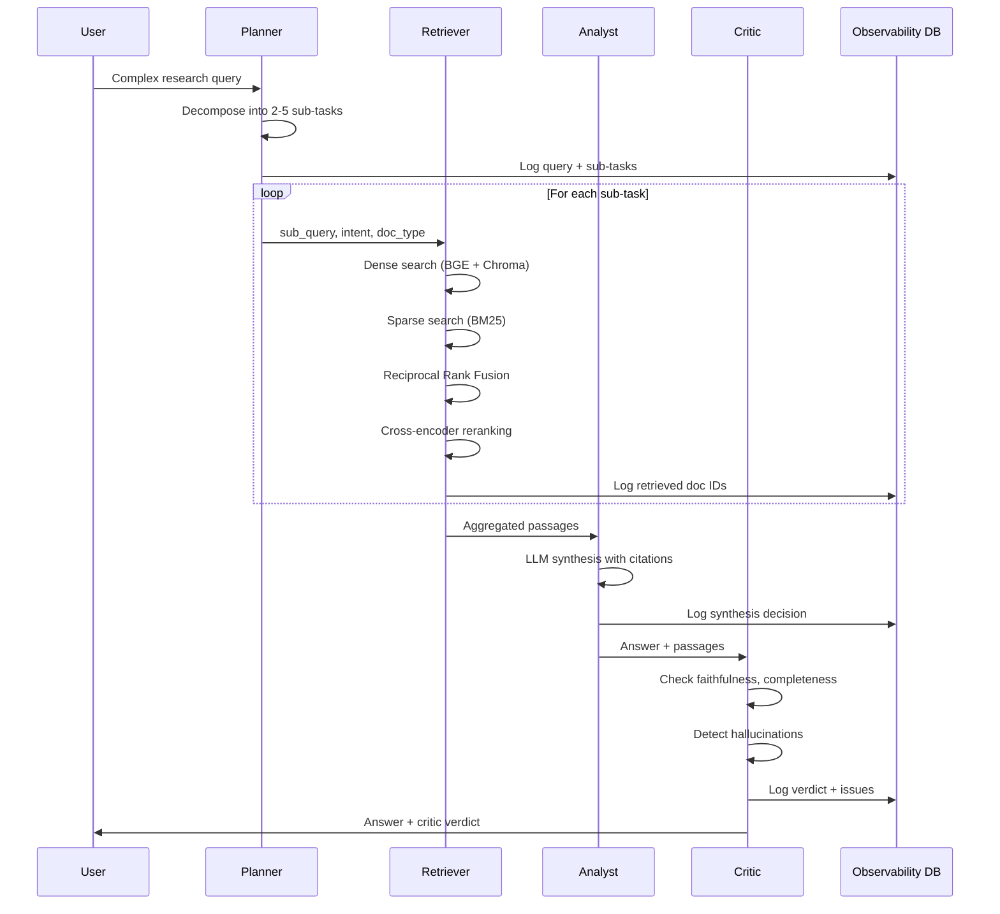
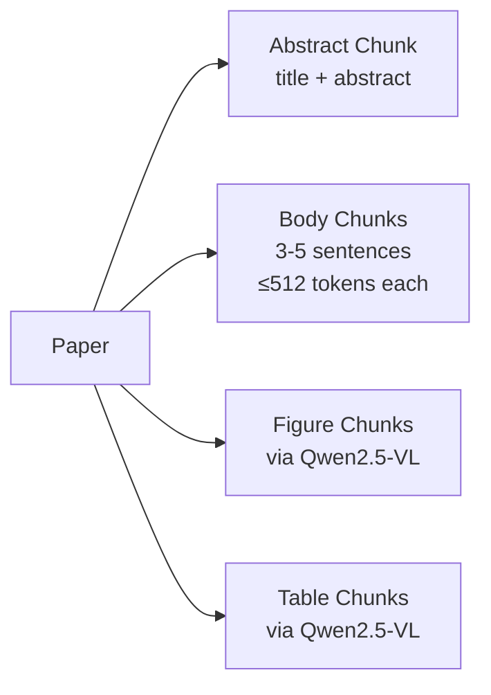
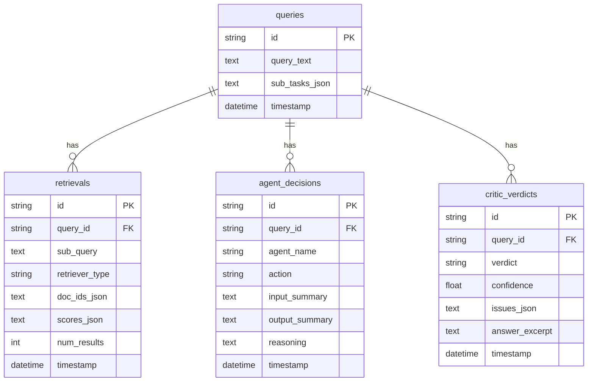

# Architecture

## System Overview

The Research Corpus AI Agent is a modular system with four major subsystems:

1. **Data Pipeline** — ingestion, chunking, embedding, and vision extraction
2. **Retrieval Engine** — hybrid search with dense, sparse, and late-interaction retrieval
3. **Agent Layer** — multi-agent reasoning for query decomposition, synthesis, and verification
4. **Observability** — full logging of all decisions and retrievals to SQLite

---

## Data Flow



---

## Agent Orchestration



---

## Retrieval Architecture

### Hybrid Search Strategy

The system employs three complementary retrieval methods:

| Method | Model | Strength | Index |
|--------|-------|----------|-------|
| Dense | BAAI/bge-large-en-v1.5 | Semantic similarity | ChromaDB |
| Sparse | BM25 (rank_bm25) | Exact keyword matching | Pickled index |
| Late Interaction | ColBERT v2 (pylate) | Token-level matching | PLAID index |

### Reciprocal Rank Fusion

Results from all retrievers are combined using RRF:

```
score(d) = Σ 1 / (k + rank_i(d))    where k = 60
```

This parameter-free fusion is robust across different score distributions.

### Reranking

After fusion, candidates are re-scored using a cross-encoder (`ms-marco-MiniLM-L-12-v2`) which jointly attends to query and passage for more accurate relevance estimation.

---

## Embedding Strategy

| Property | Value |
|----------|-------|
| Model | BAAI/bge-large-en-v1.5 |
| Dimension | 1024 |
| Doc prefix | `"Represent this passage for retrieval: "` |
| Query prefix | `"Represent this query for retrieval: "` |
| Normalization | L2 normalized |
| Batch size | 64 |
| Distance metric | Cosine (via Chroma HNSW) |

---

## Chunking Strategy



Each chunk carries metadata: `paper_id`, `title`, `authors`, `year`, `chunk_index`, `chunk_type`.

Chunk types: `abstract`, `body`, `figure`, `table`.

---

## Agent Design

### Planner
- **Input**: Complex research query
- **Process**: LLM decomposes into 2–5 sub-tasks with `sub_query`, `intent`, `expected_doc_type`
- **Intent types**: factual, comparative, methodological, survey, trend

### Retriever
- **Input**: List of sub-tasks
- **Process**: Runs hybrid search per sub-task, deduplicates across sub-tasks
- **Output**: Aggregated, reranked passages

### Analyst
- **Input**: Query + retrieved passages
- **Process**: LLM synthesizes a coherent answer with `[paper_id]` citations
- **Constraints**: Only uses information from provided passages

### Critic
- **Input**: Query + answer + passages
- **Process**: LLM evaluates on 5 dimensions (faithfulness, completeness, citation accuracy, coherence, hallucination)
- **Output**: Structured verdict (`pass`/`fail`/`partial`) with issues and confidence score

---

## Observability Schema



---

## Technology Stack

| Layer | Technology |
|-------|-----------|
| Embeddings | sentence-transformers (BGE-large-en-v1.5) |
| Dense Index | ChromaDB (persistent, HNSW) |
| Sparse Index | rank_bm25 (BM25Okapi) |
| Late Interaction | pylate (ColBERT v2 PLAID) |
| Reranking | sentence-transformers (CrossEncoder) |
| LLM Inference | HuggingFace InferenceClient |
| Vision | Qwen2.5-VL (transformers) |
| PDF Processing | PyMuPDF |
| Observability | SQLAlchemy + SQLite |
| Retry Logic | tenacity |
